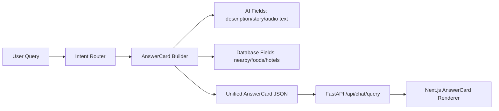

# AnswerCard Schema System

Round: JAG-R007

## Purpose

AnswerCard 是 Japan AI Guide 的核心数据协议。后续 AI、内容库、数据库、地图、音频、推荐和包车入口都必须通过同一个 AnswerCard 结构向前端输出。

本轮只定义协议、类型和 Mock 数据，不接真实 AI、数据库、地图、TTS 或包车业务。

## Frontend And Backend Files

- Frontend type: `frontend/types/answer_card.ts`
- Frontend compatibility re-export: `frontend/types/answer-card.ts`
- Frontend mock: `frontend/mock/mock_answer_cards.ts`
- Backend schema: `backend/app/schemas/answer_card.py`
- Backend mock: `backend/app/mock/mock_answer_cards.py`

## Field List

| Field | Type | Required | Description | Future Source |
| --- | --- | --- | --- | --- |
| `id` | string | yes | Stable card id. | database or builder |
| `card_type` | enum | yes | Card display and routing type. | intent router |
| `title` | string | yes | Main display title. | AI or database |
| `subtitle` | string | yes | Area/category subtitle. | database or computed |
| `description` | string | yes | Short answer summary. | AI |
| `story` | string | yes | Longer explanation or travel narrative. | AI |
| `audio` | object | yes | TTS text/audio placeholder. | AI/TTS |
| `nearby` | array | yes | Nearby spots, stations, shops, etc. | database |
| `foods` | array | yes | Food recommendations. | database |
| `hotels` | array | yes | Hotel or stay area recommendations. | database |
| `actions` | array | yes | UI actions such as route, map, audio, follow-up. | computed |
| `metadata` | object | yes | Language, mock flag, source markers, field provenance. | builder |

## card_type

| card_type | Usage |
| --- | --- |
| `spot_card` | Single attraction or place, such as 清水寺 or 大阪城. |
| `city_card` | City-level guide, such as 京都. |
| `food_card` | Food or restaurant-topic answer. |
| `route_card` | Route, itinerary, time plan, or movement sequence. |
| `culture_card` | Culture, etiquette, history, religion, or explanation. |
| `generic_card` | Fallback answer when intent is not specific enough. |

## JSON Example

```json
{
  "id": "spot_kiyomizu",
  "card_type": "spot_card",
  "title": "清水寺",
  "subtitle": "京都 · 东山区",
  "description": "京都代表性寺院，以木造舞台、东山街区和四季景观闻名。",
  "story": "清水寺适合第一次到京都的旅行者。它把寺院建筑、参拜文化、坡道街区和城市眺望集中在一条步行路线上。",
  "audio": {
    "text": "清水寺是京都东山最具代表性的寺院之一。",
    "voice": "zh-CN-guide",
    "source": "mock"
  },
  "nearby": [
    {
      "name": "二年坂",
      "type": "spot",
      "distance_text": "步行约8分钟",
      "description": "石板坡道与伴手礼街区。",
      "source": "database"
    }
  ],
  "foods": [
    {
      "name": "抹茶甜点",
      "area": "东山",
      "description": "适合和清水寺路线组合。",
      "source": "database"
    }
  ],
  "hotels": [
    {
      "name": "京都站周边酒店",
      "area": "京都站",
      "description": "交通方便，适合首次到访。",
      "source": "database"
    }
  ],
  "actions": [
    {
      "label": "生成半日路线",
      "action": "create_route",
      "enabled": true,
      "payload": {},
      "source": "computed"
    }
  ],
  "metadata": {
    "language": "zh-CN",
    "mock": true,
    "sources": ["mock", "database", "computed"],
    "ai_fields": ["description", "story", "audio.text"],
    "database_fields": ["nearby", "foods", "hotels"]
  }
}
```

Minimum shape requested by this round:

```json
{
  "card_type": "spot_card",
  "title": "清水寺",
  "subtitle": "京都 · 东山区",
  "description": "...",
  "story": "...",
  "audio": {},
  "nearby": [],
  "foods": [],
  "actions": []
}
```

## Frontend Render Logic

`frontend/src/components/chat/AnswerCard.tsx` receives `Partial<AnswerCard>` and merges it with a safe fallback card. This prevents the UI from crashing when fields are missing during future AI or API experiments.

Rendering rules:

- `card_type` controls badge label and color.
- `title`, `subtitle`, `description` render in the card header.
- `audio.text` renders in the audio placeholder block.
- `story` renders as the main explanation.
- `nearby`, `foods`, and `hotels` render as three list panels.
- `actions` render as buttons, disabled when `enabled=false`.
- `metadata` renders a small source/debug line.

## Backend Return Logic

`backend/app/mock/mock_answer_cards.py` owns all Mock AnswerCard data and keyword matching for now.

`backend/app/services/chat_service.py` calls:

```python
get_mock_answer_card(question)
```

and wraps the result as:

```python
ChatQueryData(question=question, answer_card=card)
```

`/api/chat/query` returns the same unified AnswerCard schema under `data.answer_card`.

## Future AI Fields

Likely generated or refined by AI:

- `description`
- `story`
- `audio.text`
- parts of `actions.label`
- fallback `generic_card` wording

## Future Database Fields

Likely sourced from content library or database:

- `id`
- canonical `title`
- `subtitle` area labels
- `nearby`
- `foods`
- `hotels`
- map identifiers inside future action payloads

## Protocol Relationship


